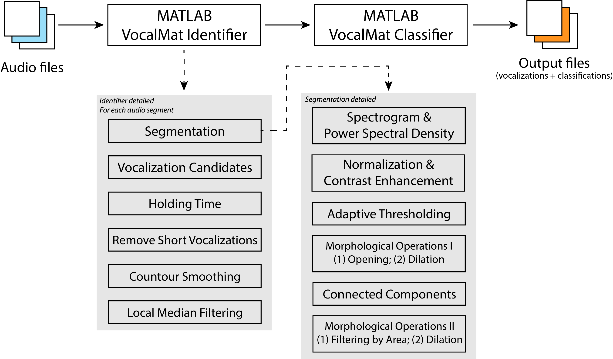
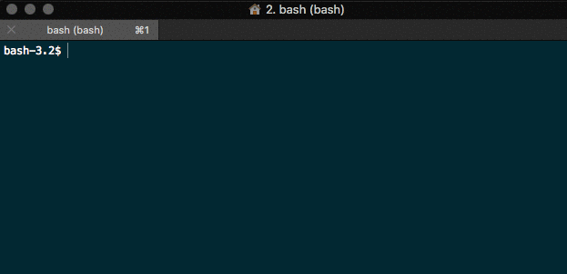

<h1 align="center">VocalMat</h1>
<div align="center">
    <strong>Automated Tool for Mice Vocalization Detection and Classification</strong>
</div>

<div align="center">
    <br />
    <a href="http://www.dietrich-lab.org"></a>
</div>

<div align="center">
    <sub>This tool was built @ Dietrich Lab, Department of Comparative Medicine, Yale University.
</div>

<div align="center">
    <br />
    <!-- MATLAB version -->
    <a href="https://www.mathworks.com/products/matlab.html">
    
    </a>
    <!-- LICENSE -->
    <a href="#">
    
    </a>
    <br />
</div>

## Table of Contents
- [Description](#description)
- [Features](#features)
- [Getting Started](#getting-started)
- [Usage](#usage)
- [FAQ](#faq)
- [License](#license)

---
---
---

## Description
> **VocalMat is an automated tool that identifies and classifies mice vocalizations.**

<p align="justify"> VocalMat is divided into two main components. The VocalMat Identifier, and the VocalMat Classifier.



<p align="justify"> VocalMat Identifier detects vocalization candidates in the audio file. Vocalization candidates are detected through a series of morphological operations and differential geometry analysis of the spectrogram. The VocalMat Identifier outputs a MATLAB formatted file (.MAT) with information about the spectral content of detected vocalizations (e.g., frequency, intensity, timestamp), that is later used by the VocalMat Classifier.

<p align="justify"> VocalMat Classifier uses a Convolutional Neural Network (CNN) to classify each vocalization candidate into 12 distinct labels: short, flat, chevron, reverse chevron, downward frequency modulation, upward frequency modulation, complex, multi steps, two steps, step down, step up, and noise.


## Features
- __11 Classification Classes:__ VocalMat is able to distinguish between 11 classes of vocalizations, according to adapted definitions from [Grimsley et al, 2011](https://journals.plos.org/plosone/article?id=10.1371/journal.pone.0017460).
- __Noise Detection:__ eliminates vocalization candidates associated to mechanical or segmentation noise.
- __Harmonic Detection:__ detects vocalizations with components overlapping in time.
- __Fast Performance:__ optimized versions for personal computers and high-performance computing (clusters)

## Getting Started


#### Latest Stable Release
```bash
$ git clone https://github.com/ahof1704/VocalMat.git
```

#### Requirements
##### Recording Requirements
- __Recording protocol:__ follow the protocol established by [Ferhat et al, 2016](https://www.jove.com/pdf/53871/jove-protocol-53871-recording-mouse-ultrasonic-vocalizations-to-evaluate-social).
- __Sampling rate:__ all recordings must have a sampling rate of 250kHz (Fmax=125kHz).

##### Software Requirements
- __MATLAB:__ versions 2017a through 2018b. For other versions refer to the [FAQ](#faq).
- __MATLAB Add-Ons:__
    - Signal Processing Toolbox
    - Deep Learning Toolbox
    - Image Processing Toolbox
    - Statistics and Machine Learning Toolbox

#### Directory Structure
- __vocalmat_identifier:__ everything related to the VocalMat Identifier
- __vocalmat_classifier:__ everything related to the VocalMat Classifier
- __audios:__ place the audio files you want to process in the `audios` directory

## Usage

#### `VocalMat` Manual Execution
<p align="justify">Navigate to the VocalMat directory in MATLAB and run <i>VocalMat.m</i> by either opening the file or typing VocalMat in MATLAB's command window. Once VocalMat is running, choose the audio file you want to analyze. An example audio file is provided, and you can use it to see how VocalMat works.

<!-- The <i>Identifier</i> will output two .MAT files in the same directory that the audio file is in, <i>output_*.mat</i> (which contains the spectrograms content and detailed spectral features for each vocalization) and <i>output_shorter_*.mat</i> (same information, except the spectrogram content). The <i>Classifier</i> will create a directory with its outputs (vocalizations and classifications) in that same directory that the audio file is in. -->

#### `VocalMat` Output Files

<p align="justify">VocalMat outputs a directory with the same name as the audio file that was analyzed. Inside that directory there will be two directories (<i>All</i>, <i>All_axes</i>), and two Microsoft Excel (.xlsx) files. Inside <i>All_axes</i> you will find one image for each vocalization candidate detetcted with the resuting segmentation illusrated by sparsed blue dots. The raw original images are available inside <i>All</i>. The main Excel file has the same name of the audio file analyzed (<i>audio_file_name</i>.xlsx). This file contains information on each vocalization, such as start and end time, duration, frequency (minimum, mean and maximum), bandwidth, intensity (minimum, mean, maximum and corrected based on the backgroun), existence of harmonic components or distortions (noisy) and call type. The second excel file named as <i>audio_file_name</i>_DL.xlsx shows the probability distribution for each vocalization candidate across the different labels.

#### Personal Use (bash script)
```bash
$ ./run_identifier_local [OPTIONS]
```
##### Examples
VocalMat help menu
```bash
$ ./run_identifier_local -h
or
$ ./run_identifier_local --help
```
Running VocalMat using 4 threads:
```bash
$ ./run_identifier_local -c 4
or
$ ./run_identifier_local --cores 4
```

#### High-Performance Computing (Clusters with Slurm Support, bash script)
```bash
$ ./run_identifier_cluster [OPTIONS]
```
##### Examples
Running VocalMat and getting execution (slurm) notifications to your email:
```bash
$ ./run_identifier_cluster -e your@email.com
or
$ ./run_identifier_cluster --email your@email.com
```

Running VocalMat using 4 cores, 128GB of RAM, walltime of 600 minutes, and getting notifications to your email:
```bash
$ ./run_identifier_cluster -e your@email.com -c 4 -m 128 -t 600
or
$ ./run_identifier_cluster --email your@email.com --cores 4 --mem 128 --time 600
```

## FAQ
- Will `VocalMat` work with my MATLAB version?
<p align="justify">VocalMat was developed and tested using MATLAB 2017a, 2017b, 2018a, and 2018b versions. We cannot guarantee that it will work in other versions of MATLAB. If your MATLAB versions supports all the required Add-Ons, VocalMat should work.

- What are the hardware requirements to run `VocalMat`?
<p align="justify">The duration of the audio files that can you use in VocalMat is limited to the amount of RAM that you have in your computer. We estimate around 1GB of RAM for every minute of recording using one minute segments. For a 10 minute recording, you should have at least 10GB of RAM available. RAM usage will vary depending on your MATLAB version and computer, these numbers are just estimates.

- Will `VocalMat` work with my HPC Cluster?
<p align="justify"> In order for our script to work in your Cluster it must have Slurm support and have both deadSimpleQueue and MATLAB modules. We use the standard `module load` command to load modules. Minor changes might have to be made to adapt the script to your Cluster configuration.

## License
<div>
    <a href="#">
    
    </a>
</div>

- **[Apache License 2.0](https://github.com/ahof1704/VocalMat/blob/VocalMat_RC/LICENSE)**
- Copyright 2019 © <a href="http://www.dietrich-lab.org" target="_blank">Dietrich Lab</a>.

If you use VocalMat or any part of it in your own work, please cite [Fonseca et al](#):
```
(to appear)
@article{vocalmat,
    author =       "",
    title =        "",
    journal =      "",
    volume =       "",
    number =       "",
    pages =        "",
    year =         ""
}
```

<!-- version-control: 1.0 -->